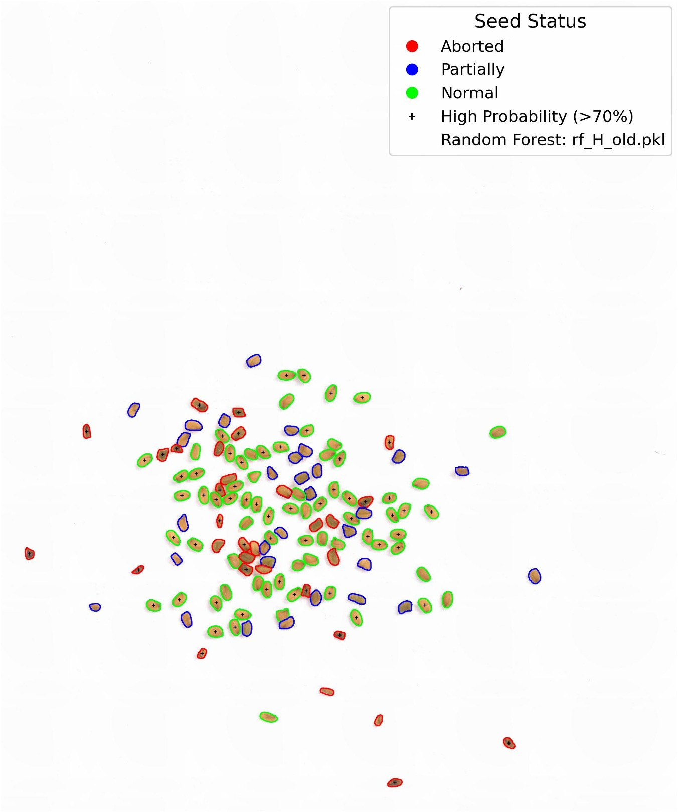

# **Samplify: Seed Image Segmentation and Classification**

## Overview

Samplify is a tool designed for processing *Arabidopsis thaliana* seed images using a hybrid segmentation approach. It combines classical image segmentation techniques with Meta's **Segment Anything Model (SAM)**. The segmented seeds are classified into three categories (**Normal, Partially Aborted, Aborted**) using a **Random Forest classifier**.

Samplify provides two modes:

- **Full segmentation & classification**: Performs segmentation and classifies seeds, saving results as:
  - **Images**: Color-coded contour overlays.
  - **CSV file**: Contains seed contour parameters for each image.
  - **Excel file**: Summary statistics with seed type counts for each image.
- **Segmentation-only**: Detects and segments seeds without classification, saving only:
  - **CSV file**: Contains seed contour parameters for each image.

## Features

- **Hybrid Segmentation**: Uses classical methods and deep learning for accurate seed detection.
- **Random Forest Classification**: A trained model predicts seed types.
- **Comprehensive Output**:
  - Predicted seed labels and probabilities.
  - Summary reports (classification accuracy, confidence, execution time).
  - Contour visualization of detected seed regions.

---

## Prerequisites
Install SAM2 by following the guide on Github: https://github.com/facebookresearch/sam2
GPU capacities for computing

## Usage Guide

1. Clone this repository

```bash
git clone https://github.com/Ronja-Mueller/Samplify
```

2. Load Required Modules

```bash
pip install numpy pandas cv2 skimage sklearn joblib matplotlib torch tqdm
```

3. Start a screen session

```bash
screen -S samplify_session
```
4. Run Samplify

```bash
samplify.py image_folder
```

- Wait for the estimated execution time, displayed in red (can take up to **5 minutes**).
- To detach the session and keep it running in the background, press:
  ```bash
  Ctrl + a + d
  ```

5. Check Progress
   
- Reattach to the session:
  ```bash
  screen -r samplify_session
  ```

**Retrieve Output**

Processed files are stored in the `out` subdirectory of the image_folder

---

## Samplify Command-Line Prompts 

```bash
samplify.py <directory> [rf_model_path] [--segmentation-only] [--regenerate-summary]
```

### **Arguments**

**Mandatory:**

- `<directory>`: Path to images

**Optional:**

- `<rf_model_path>`: Path to the Random Forest model (default: `TripBlockDefault_RF.pkl`).
- `--segmentation-only`: Run segmentation without classification.
- `--regenerate-summary`: Skip image analysis and regenerate a .xlsx summary from an existing seed_parameters_*.csv file in the given 'out' directory.
This avoids reprocessing images.

### **Examples**

#### Full Segmentation & Classification with your own RF

```bash
samplify.py /path/to/images /path/to/your/rf_model.pkl
```

#### Segmentation-Only:

```bash
samplify.py /remote/path/to/images --segmentation-only
```

#### Regenerate Summary from previous runs:
```bash
samplify.py /path/to/out --regenerate-summary
```

### **Input Requirements**

- **Image formats**: `.jpg`, `.png`, `.tif`, etc.
- Your own **Random Forest**: Trained with the rf_pipeline.py (described below) to ensure feature consistency.

### **Output Files**
All files are stored in a newly created `out` directory in your /path/to/images directory.

| File Type             | Description                                                                          |
| --------------------- | ------------------------------------------------------------------------------------ |
| `predicted_images/`   | Directory containing the processed images with contours (if classification enabled). |
| `seed_parameters.csv` | CSV file with seed parameters and classification results.                            |
| `seed_summary.xlsx`   | Image-wise summary of classification performance.                                    |

### Examplatory image with contours


---

## Training a Random Forest Model

To train your own **Random Forest classifier** with the script `rf_pipeline.py`, follow these steps:

**Prerequisites**
- Images of your *arabidopsis thaliana* seeds (preferably taken following the standardized image acquisition protocol by Dr. Heinrich Bente, see below)
- ImageJ labeling of the images (Label 0: "Normal", Label 1: "Partially", Label 2: "Aborted")

**1. Generate Seed Features CSV**

Run Samplify in segmentation-only mode to extract seed features for your train (and test) images.

**2. Label Data Using ImageJ**

- Open ImageJ and label all train (and test) images manually with the "Multi-point"-Tool.
- Prepare the labeling information for the script by extracting text files:
  - In ImageJ click: Plugins > Macros > Run
  - Select `Macro_save_labels.ijm` (downloaded beforehand)
    - Select your image directory containing all you labeled tiff files
    - The macro saves all `.txt` files in a new `TXT` directory in your image directory.
- Check naming convention: label information of `image123.jpg` should be found in `image123.txt`
- Summarize all `.txt`files of all your train (and test) images in one directory /path/to/labels

**Train the RF Model**

Run the training script.

```bash
rf_pipeline.py <train_file> [--label_dir LABEL_DIR] [--test_dir TEST_DIR] [--output_dir OUTPUT_DIR] 
```

#### **Arguments**

**Mandatory:**

- `<train_file>`: CSV dataset with training data.

**Optional:**

- `--label_dir`: Directory containing label TXT files for each unlabeled image of training and testing data.
- `--test_dir`: Directory with 1 or more test datasets (file ending `.csv`).
- `--output_dir`: Directory for the trained model. Default: `rf_training_output`.

#### **Example**

Training and testing a Random forest for already labeled data:

```bash
rf_pipeline.py path/to/seed_parameters.csv --test_dir path/to/test_datasets/
```

Training and testing a Random forest for un-labeled data:

```bash
rf_pipeline.py path/to/seed_parameters.csv --test_dir path/to/test_datasets/ --label_dir path/to/labels
```

*Answer all the questions prompted by the program to ensure correct training documentation. Please also read the Standard Image Acquisition Protocol at the end of this file.*

### **Output Files**

| File Type                         | Description                                                                               |
| --------------------------------- | ----------------------------------------------------------------------------------------- |
| `your_rf_model.pkl`               | Your trained and named RF model which then can by used by "Samplify"                      |
| `train_results.csv`               | TXT file with accuracy and classification report for the training data                    |
| `test_results.csv`                | TXT file(s) with accuracy and classification report of the corresponding test data        |
| `feature_importance.jpg`          | Image that depicts the feature importance of the trained Random Forest                    |
| `confusion_matrix.jpg`            | Confusion Matrix for the performance of the Random Forest on the corresponding test data  |
| `error_log.txt`                   | Lists errors that occurred during the processing                                          |
| `rf_training_documentation.json`  | Documentation about the datasets, training process and the trained Random Forest Model    |


**Important:** Keep the `rf_training_documentation.json` for documentation of the Random Forest Training. 
To inspect the documentation you can open the file with Word. Alternatively, you can open it in an Online json file viewer.

---

## Standardized Image Acquisition

To ensure high-quality segmentation and classification, follow this imaging protocol using the **Keyence Digital Microscope VHX-6000**:

**Microscope Settings**

- Use **50x magnification (blue lens)**.
- Set scale to **1 mm**, with black text and lines.
- Place scale in the **bottom right** of the image.

**Seed Spread & Background**

- Use **plain white printer paper** as background.
- Spread seeds within a **20 mm diameter** area.

**Lighting & Exposure**

- Use **full ring light** to reduce shadows.
- Autofocus on the seed cluster.
- Adjust lighting for **slight overexposure** (shadows removed, contours visible).

**Image Naming & Format**

- Use machine-readable names, e.g., `xhb938.jpg`.

By following these standards, image quality is optimized, improving segmentation and classification accuracy. Images should look like this:


---

## Credits

Developed in collaboration with **Prof. Dirk Walther** (Ag Bioinformatcs, MPI) and **Dr. Heinrich Bente** (AG Köhler, MPI).

For questions or support, contact: Ronja Müller, ronja_mueller@gmx.net

